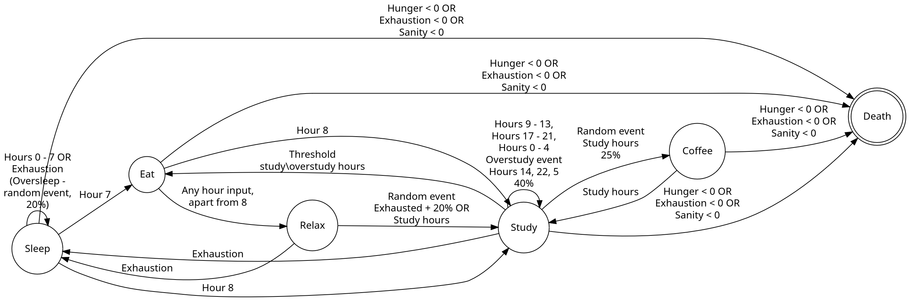

# Finite-Automata
Simulating a day of CS student with finite state machines
### Installation
Clone the repo, cd into it and run main.py  
`git clone https://github.com/n1n1n1q/Finite-Automata`  
`cd Finite-Automata`  
`python main.py`
### Discrete principles
The simulation is done with finite state machines, implemeted via Python coroutines.  
The machine has the following states:
* Sleep
* Eat
* Study
* Coffee break
* Relax
* Death 

Apart from states, some random events can occur
* Oversleep *with 20%*
* Overstudy *with 40%*
* Messed up cooking *with 25%*
* Decision to continue studying despite being exhausted *with 20%*
* Random coffee's quality *(from coffee machine not working to the best coffee of your life)*

There are such parameters as energy level, hunger and sanity as well. If they are too low, the model is going to die. These parameters usually change with states transition.  
You can see the FSM's scheme below *(.dot file included in repo as well)*

### Credits
[Building FSM with Python coroutines on Dev.to](https://dev.to/arpit_bhayani/building-finite-state-machines-with-python-coroutines-5gm2)